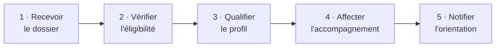

# Orienter un allocataire RSA vers le bon accompagnement

**Pour les conseils départementaux.** De la réception du dossier à la notification de l'orientation, ce parcours couvre l'enchaînement complet — l'orchestration est fournie, vos équipes restent autonomes.

---

## Le parcours

Chaque étape consomme la sortie de la précédente. L'ordre, les dépendances inter-étapes et les données propagées sont décrits dans [`parcours.arazzo.yaml`](./parcours.arazzo.yaml) — **la notice de montage, versionnée et testable**.

---

## Avant / après

| | |
|---|---|
| **Avant** | ~[X] tickets par dossier · [X] semaines · hotline sollicitée |
| **Après** | En autonomie · [X] semaines · zéro ticket |

---

## Les API mobilisées

Les contrats des API utilisées par ce parcours sont documentés sur le catalogue officiel — **on ne les duplique pas ici** :

| API (→ francetravail.io) | Version validée pour ce parcours | Rôle dans le montage |
|---|---|---|
| [API [X] — lien francetravail.io] | v[X] | Réception et suivi du dossier |
| [API [X] — lien francetravail.io] | v[X] | Qualification et orientation |

> ⚠️ Ce parcours est validé contre les versions ci-dessus. Une montée de version d'une API mobilisée déclenche une revalidation du parcours (règle Last Call).

---

## Démarrer

| Étape | Où | Vous obtenez |
|---|---|---|
| **1. Comprendre** | [`processus-metier/`](./processus-metier/) | Le contexte, les acteurs, les règles de gestion |
| **2. Rejouer** | [`postman/`](./postman/) | Le parcours exécuté de bout en bout, sans écrire une ligne de code |
| **3. Intégrer** | [`exemples/`](./exemples/) | Une intégration commentée à adapter |

**Pré-requis d'accès** : conventionnement + FT Connect — voir [`transverse/`](../../transverse/).

---

## Questions sur ce parcours

Ouvrez une [issue](../../../../issues) préfixée `[rsa]`.

---

_Version du parcours : v0.1 · Dernière validation : [X]_
