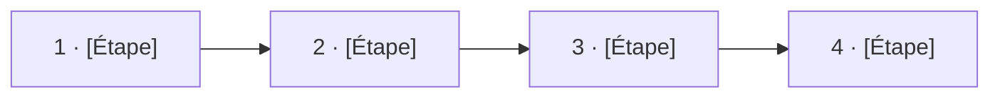

<!--
  GABARIT — à copier, ne pas modifier ce dossier directement.
  1. Copier _template/ sous un nom métier : verbe-objet-contexte (ex. transmission-dossier-cd)
  2. Remplacer tous les [À REMPLACER : ...]
  3. Laisser les [X] visibles tant que la valeur n'est pas connue
  4. Configurer aussi, hors fichier : le titre de la ligne dans le README racine
-->

# [À REMPLACER : le job, en langage métier — verbe + objet + bénéfice]

**Pour les [À REMPLACER : type de partenaire].** [À REMPLACER : une phrase — de quel point de départ à quel point d'arrivée, et ce que le partenaire n'a plus à faire seul.]

---

## Le parcours 

<!-- La notice visuelle : une boîte par étape métier, dans l'ordre du montage.
     Règle : des libellés MÉTIER (Recevoir, Vérifier...), jamais des noms d'endpoints. -->

// David : MERMAID MACRO + LIEN VERS EXCALIDRAW

Chaque étape consomme la sortie de la précédente. L'ordre, les dépendances inter-étapes et les données propagées sont décrits dans [`parcours.arazzo.yaml`](./parcours.arazzo.yaml) — **la notice de montage, versionnée et testable**.

---

## Avant / après

| | |
|---|---|
| **Avant** | [À REMPLACER : la douleur — tickets, délais, ressaisies] |
| **Après** | [À REMPLACER : l'autonomie — délai cible, zéro ticket] |

---

## Les API mobilisées

Les contrats des API utilisées par ce parcours sont documentés sur le catalogue officiel — **on ne les duplique pas ici** :

| API (→ francetravail.io) | Version validée pour ce parcours | Rôle dans le montage |
|---|---|---|
| [À REMPLACER : nom + lien FT.io] | v[X] | [À REMPLACER] |
| [À REMPLACER : nom + lien FT.io] | v[X] | [À REMPLACER] |

> ⚠️ Ce parcours est validé contre les versions ci-dessus. Une montée de version d'une API mobilisée déclenche une revalidation du parcours (règle Last Call).

---

## Démarrer

| Étape | Où | Vous obtenez |
|---|---|---|
| **1. Comprendre** | [`processus-metier/`](./processus-metier/) | Le contexte, les acteurs, les règles de gestion (voir ce qu'on trouve côté FT.io) |
| **2. Rejouer** | [`postman/`](./postman/) | Le parcours exécuté de bout en bout, sans écrire une ligne de code |

**Pré-requis d'accès** : [À REMPLACER : conventionnement, FT Connect, scopes — ou lien vers `transverse/`]
// SUR LE MVP on part sur le fait que l'arazzo du use case porte tout (le temps de voir si on peut composer les arazzo)

---

## Questions sur ce parcours

Ouvrez une [issue](../../../../issues) préfixée `[À REMPLACER : tag court, ex. rsa]`.

---

_Version du parcours : v0.1 · Dernière validation : [X]_
