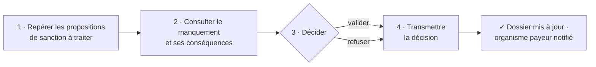

# Donner suite aux propositions de sanction

**Pour les conseils départementaux.** [À REMPLACER : une phrase — de quel point de départ à quel point d'arrivée, et ce que le partenaire n'a plus à faire seul.]

---

## Le parcours 

<!-- La notice visuelle : une boîte par étape métier, dans l'ordre du montage.
     Règle : des libellés MÉTIER (Recevoir, Vérifier...), jamais des noms d'endpoints. -->

Chaque étape consomme la sortie de la précédente. L'ordre, les dépendances inter-étapes et les données propagées sont décrits dans [`parcours_arazzo_sanctions-v1.0`](./parcours_arazzo_sanctions-v1.0.yaml) — **la notice de montage, versionnée et testable**.

---

## Démarrer

| Étape | Où | Vous obtenez |
|---|---|---|
| **1. Comprendre** | [`processus-metier/`](./processus-metier/) | Le contexte, les acteurs, les règles de gestion (voir ce qu'on trouve côté FT.io) |
| **2. Rejouer** | [`postman/`](./postman/) | Le parcours exécuté de bout en bout, sans écrire une ligne de code |

**Pré-requis d'accès** : [À REMPLACER : conventionnement, FT Connect, scopes — ou lien vers `transverse/`]
// SUR LE MVP on part sur le fait que l'arazzo du use case porte tout (le temps de voir si on peut composer les arazzo)

---

## Questions sur ce parcours

Ouvrez une [issue](../../../../issues) préfixée `[À REMPLACER : tag court, ex. rsa]`.

---

_Version du parcours : v0.1 · Dernière validation : [15/09/2026]_
