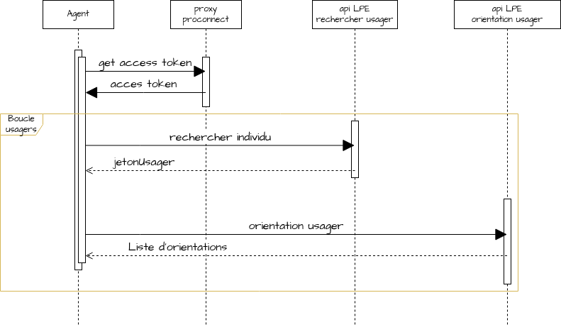

# module demo-traitementMasse

## Objectifs
- illustrer un traitement de masse pour un ensemble d'usagers sur les api LPE
- illustrer les optimisations possibles sur ce traitement de masse :
    - parallélisation des appels en tenant compte des quotas
    - stratégie de rejeu sur erreurs

## Jouer l'exemple

### Prérequis
Ce script n'a valeur que d'exemple et possède certains partis pris pour simplifier la démo.
Il s'appuie notamment sur :
- un fichier de propriété pour stocker les identifiants de connexion aux api en mode Client Credentials :

`clientId=<clientId_obtenu_via_francetravail.io>
clientSecret=<clientSecret_obtenu_via_francetravail.io>
`

Attention : idéalement l'accès à ces _credentials_ doivent être sécurisés (dans un Vault par exemple)
- un fichier au format jsonl contenant la liste des usagers (cf demo-traitementMasse/src/main/resources/resultats_DE_exemple.jsonl pour le format), point d'entrée pour boucler sur les API. Pour des raisons de confidentialité, le fichier jsonl attendu par le script n'est pas fourni (à vous d'adapter le script). A noter également : la classe fr.francetravail.demo.client.api.lpe.dataset.DatasetLauncher est à adapter pour charger le référentiel usagers selon votre contexte (chargement de fichier, requête en base, ...).

### Exécution du script
1. Créer un jar exécutable target/benchloader.jar :

`./mvnw clean install -f .\demo-traitementMasse\pom.xml`

2. Lancer le jar exécutable :

`java -jar demo-traitementMasse/target/benchloader.jar orientation c:\temp\creds.properties`

#### Détails sur les arguments :

##### 1er arg : "orientation" ou "activite-operationnelle"
###### Cas "orientation"

* Répond au cas d'utilisation suivant :
  
* Prend en entrée un fichier d'usagers au format jsonl (exemple format fichier : src/main/resources/resultats_DE_33.jsonl)

###### Cas "activité-opérationnelle"

* Répond au cas d'utilisation suivant :
  
* Nécessité d'avoir des jeux de données (génération d'activités de décision d'orientation de son département) relatifs à sa structure, et donc au clientId

##### 2nd arg : chemin du fichier contenant les credentials d'api
- Chemin du fichier de propriété contenant les propriétés _clientId_ et _clientSecret_ permettant d'interroger les api LPE (mode Client Credentials)
- Exemple :

  `
  clientId=PAR_demoExemple_64FF333
  clientSecret=564e00dd87aaaaaaaaaaaaaaabbbbbbbbbbbbbbbbbbbcccccccccccccccccddd
  `
